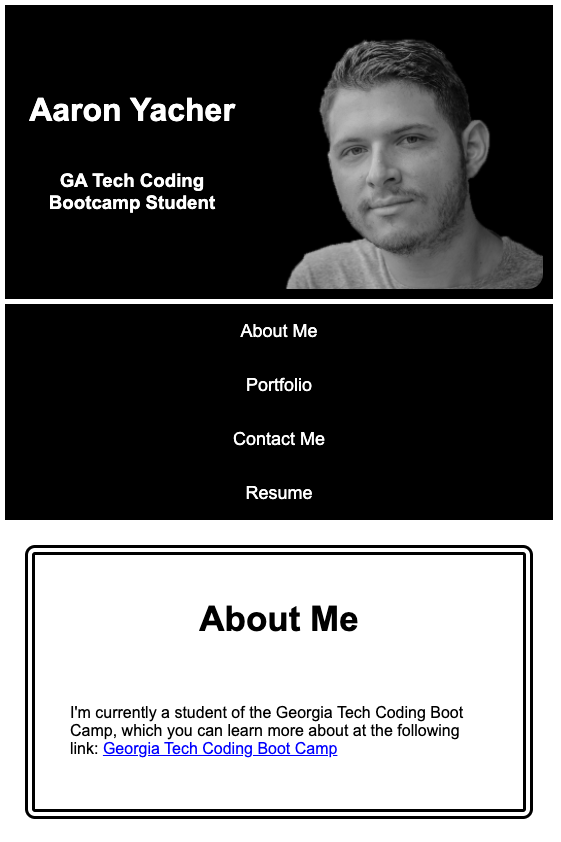

# 02-advanced-css-portfolio
Build a portfolio page

Deployed URL: https://aalink.github.io/02-advanced-css-portfolio/

This is the 2nd assignment of the Georgia Tech Coding Bootcamp. It is an exercise that explores more advanced CSS layout techniques.
It will also act as a central location to display future portfolio projects.  



```
Current State
```
> In its current state, it could be considered the first iteration of an ongoing project.  Over the course of the coding bootcamp, links to additional projects will be added, but for now only the first project on code refactoring is available to view.  All the others are place holders that will be used at a later date.
```
Primary Challenge
```
> In my view, the primary challenge in this project was making sure it was properly structured for responsive design.  The market share of mobile devices has surpassed the traditional desktop/notebook computer.  As such, the web needs to evolve towards a format that can reach those devices.  Businesses want exposure to as many customers as possible, and if they don't have an interactive and engaging way to reach them, their success will struggle.
```
Approach to a Solution and what I Learned
```
> The Flexbox Layout module is what I used in order to achieve the responsive design for this project.  As I made adjustments to my code, I used the Google Chrome web browser developer tools to preview what the page would look like on different devices.  This was a helpful learning experience because it introduced me to a workflow that complements whichever coding editor a web developer chooses to use. Having immediate feedback while making modifications to the styles helped to prototype various layouts which I could then copy and paste into the code editor.